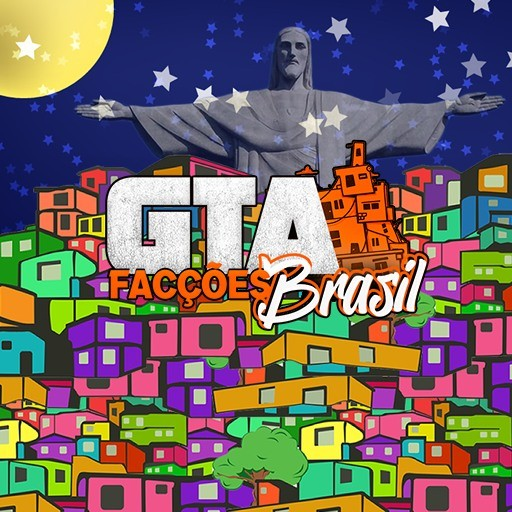

<h1 align="center"> GTA Facções v1.1</h1>

GTA Facções foi um servidor de GTA online jogado por muitos players.  

ATENÇÃO: Este jogo trata-se apenas de uma demonstração da realidade vivida em alguns bairros do Rio de janeiro.  
Não fazemos apologia ao crime organizado  

  <a href="#-tecnologias">Tecnologias</a>     |    
  <a href="#-projeto">Projeto</a>     |    
  <a href="#-layout">Layout</a>     |    
  <a href="#memo-licença">Licença</a>

  

 

  

##  🚀 Tecnologias

Esse projeto foi desenvolvido com as seguintes tecnologias:

- Pawno (É uma linguagem de quarta geração, influenciada pela linguagem C.)
- MySQL
- Git e Github

##  💻 Projeto

GTA San andreas é um servidor de jogo online para se divertir com os amigos.

<a href="https://www.youtube.com/watch?v=QFZeA2PH2PQ" target="_blank">- [Visite o projeto online] </a>
